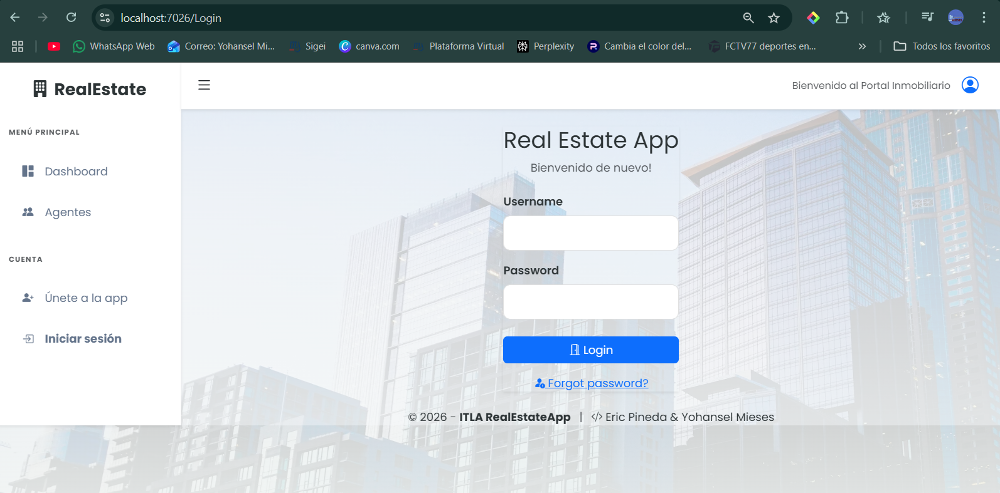
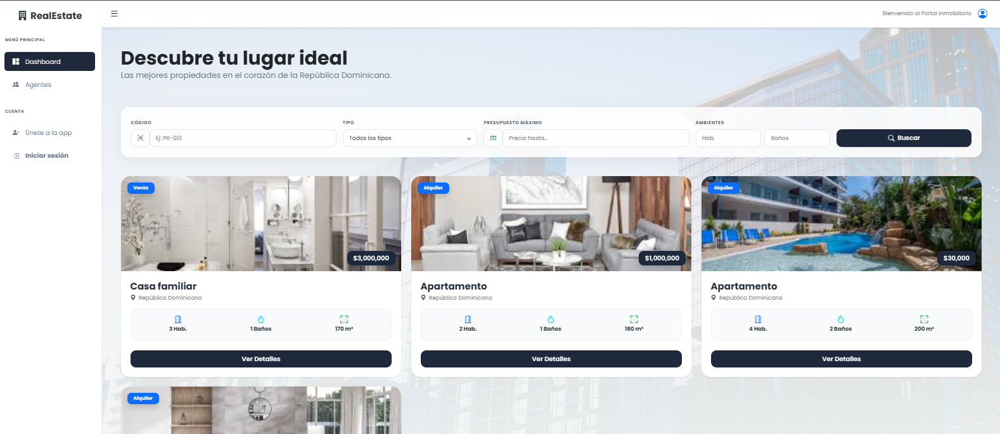
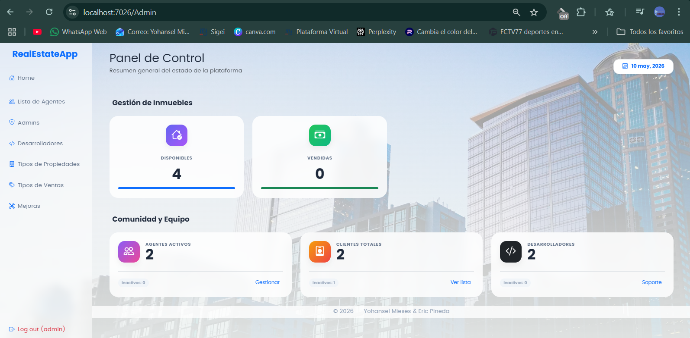
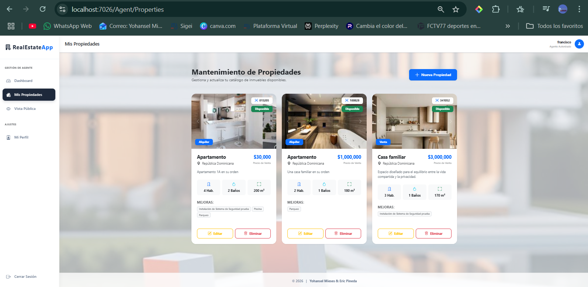
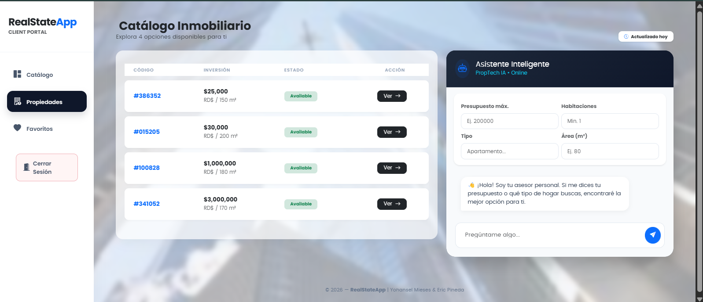
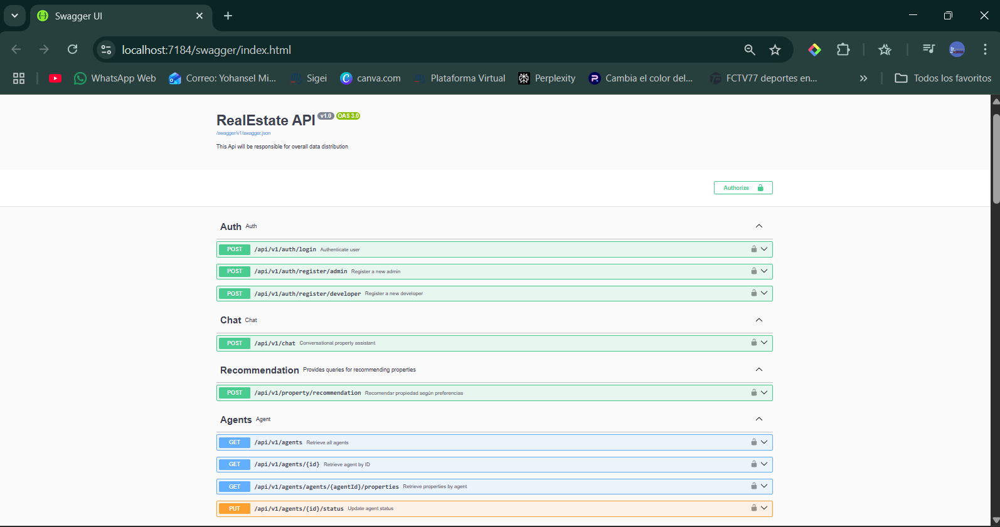
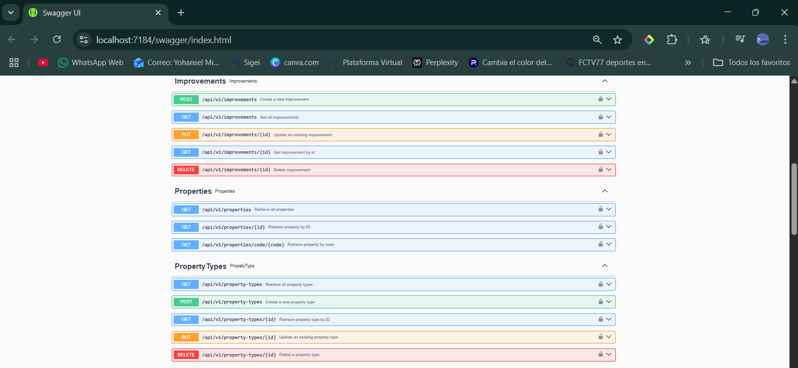
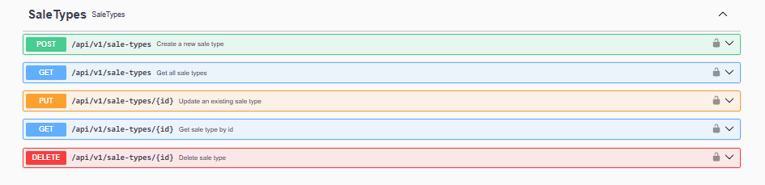

## 🏢 RealEstate – Ecosystem \& Smart Advisor

RealEstate es una plataforma de gestión inmobiliaria de alto rendimiento diseñada bajo estándares modernos de ingeniería de software. El sistema centraliza la operación de administradores, agentes y clientes en una infraestructura escalable, segura y con una experiencia de usuario de nivel empresarial.

## 🧠 Smart Advisor: Consultoría Inmobiliaria con IA

La plataforma destaca por su Asistente de Inteligencia Artificial, un motor de recomendación avanzado que actúa como un consultor personalizado para el cliente.

* Procesamiento Inteligente: Analiza variables críticas como presupuesto, tipología de inmueble, dimensiones y distribución en tiempo real.
* Algoritmo de Matching: Utiliza un sistema de scoring interno para contrastar las necesidades del usuario con el catálogo global, identificando la propiedad con mayor tasa de afinidad.
* Análisis Persuasivo: No solo localiza la propiedad, sino que genera una justificación técnica sobre por qué representa la mejor oportunidad de inversión para el usuario.

## 📂 Arquitectura – Onion Architecture

El proyecto implementa una arquitectura de cebolla para asegurar el desacoplamiento, la testabilidad y la facilidad de mantenimiento:

* Application: Implementación de CQRS, Handlers (MediatR), DTOs y Validadores.
* Domain: Núcleo con entidades de negocio, enums e interfaces de repositorios.
* Infrastructure: Capa de persistencia de datos (EF Core).
* Shared: Servicios transversales como envío de correos y utilidades comunes.
* Identity: Manejo integral de usuarios, perfiles de seguridad y servicios externos.
* RealEstateApi: API REST robusta protegida mediante JWT.
* RealEstateWeb: Aplicación Web MVC con autenticación basada en Cookies.
* Tests: Capa dedicada a asegurar la calidad y estabilidad del código.

## ✅ Aseguramiento de Calidad (QA)

La estabilidad del software está respaldada por una estrategia de pruebas y control de excepciones rigurosa:

* Unit \& Integration Testing: Implementación de pruebas con xUnit y FluentAssertions para las capas de Aplicación y Repositorio, validando la lógica de negocio y la persistencia.
* Resiliencia: Manejo exhaustivo de métodos ante errores, validación de valores nulos y consistencia de datos.
* Global Exception Handling: Middleware centralizado para garantizar respuestas limpias y trazables ante cualquier fallo.

## 🔧 Stack Tecnológico

* Backend: .NET 9 (C#)
* Base de Datos: SQL Server / EF Core
* Patrones: CQRS, Mediator,Repository Pattern.
* QA: Pruebas Unitarias(Testing)
* Frontend: ASP.NET MVC, CSS, Bootstrap Icons, SweetAlert2.
* Seguridad: Identity \& JWT.

## 🖼️ Experiencia de Usuario (UI/UX)

La interfaz ofrece una estética Premium y Moderna, utilizando efectos de Glassmorphism y una jerarquía visual clara.

* Dashboard de Alto Nivel: Resúmenes estadísticos con visualización de datos en tiempo real.
Consola de Chat IA: Interfaz interactiva y fluida para la comunicación directa con el asistente inteligente.

## 📸 Galería del Proyecto

En esta sección se presentan las capturas de pantalla que demuestran la funcionalidad y el diseño del sistema.

* Login
  
* Home Principal
  
* Dashboard - Admin
  
* Creacion de Propiedades - Agente
  
* ChatBot - Cliente
  

Swagger EndPoints
---
  
  
  

## 👨‍💻 Equipo de Desarrollo
* Eric Pineda – eccpineda@gmail.com
* Yohansel Mieses – miesesyohansel@gmail.com

